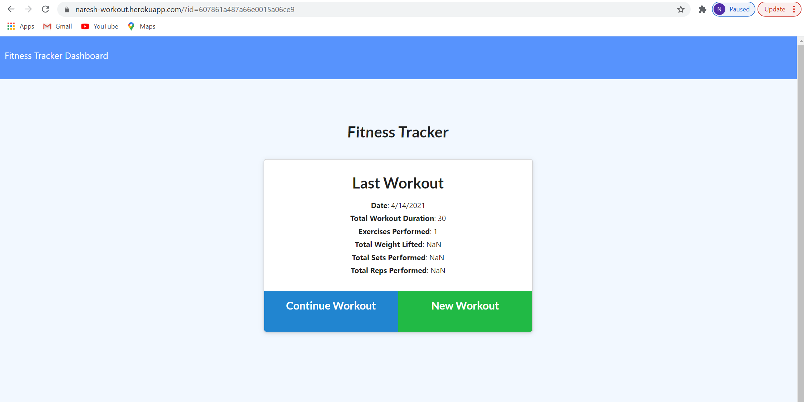
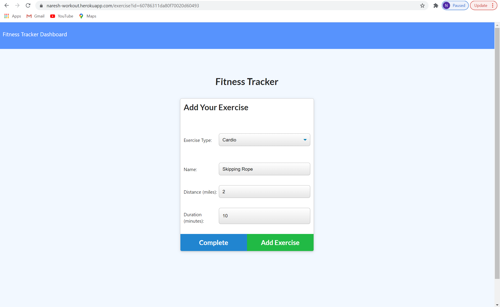
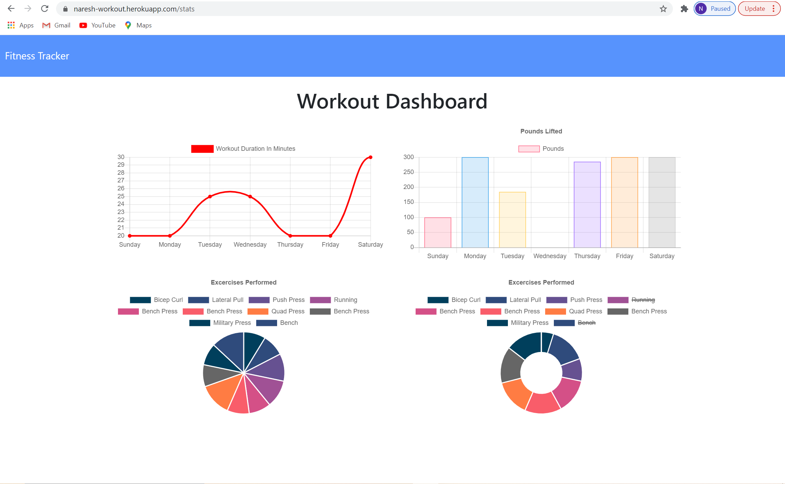

# Workout Tracker
This Workout Tracker app allows user to track a workout. Various attributes of the workout can be stored. The workouts are saved in  Mongo database.

## Description 
Created a fitness tracking app utilizing Node.js, Express.js, MongoDB, Heroku and Mongoose. Majority of the front end code was provided in as a homework prompt as part of a web development boot camp from UWA. Allows the user to track their workouts and save them in a database.

## Live site: 
https://naresh-workout.herokuapp.com/

## Images
Image of main view:

Image of adding exercises:

Image of Workout Dashboard

## Installation 
You will need to npm init to get all the required node modules. If you are running the code locally the local host is set to port 3000. You will also need to go in to the config folder and possibly change the config.json values. The file used to start the project is server.js.

## Usage 
The primary purpose of this app is to practice with MongoDB and Mongoose but this app can be used to track a workout, or as the basis of a workout app.

## Credits 
Great gratitude to Luca ([https://github.com/duvet86](https://github.com/duvet86)), Sam ([https://github.com/sam-ngu](https://github.com/sam-ngu)) from the UWA Bootcamp for their enormous help.
## Contributing 
I was the only one to work on this project, but of course I had help from my instructor, TA's, and classmates.

## License
[MIT](https://choosealicense.com/licenses/mit/)
